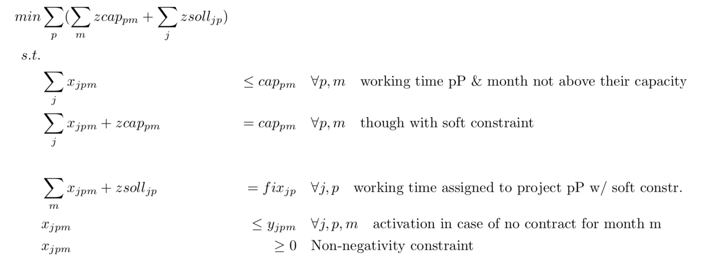

# Planning workforce with gurobi in python

A linear programming approach to determine optimal working hours in *Full-time equivalents (FTEs)* using **Gurobi** in python: `work_assignment_LP.ipynb`.   
The data `ressourcenplan.csv` (German csv) consists of **10 people** and **23 projects** over the course of **42 months**. Column "0" is projects, column "0.1" is people (or rather their job descriptions). Column "0.2" is the **total number of FTEs** over the course of the 42 months that the person will have spent in that project. This column is given as part of the problem and the goal of this script is to match this column while also keeping everyone's **capacity** in mind.  
The solution becomes only feasible when two soft constraints, *zcap* for capacity and *zsoll* for the fixed project pP allocation, were introduced.  
`work_assignment_LP.ipynb` also offers a possibility to save gurobi variables in a dataframe and creates a few visualizations of the results.

## The mathematical model
The mathematical model, described in `Work_assignment_LP.pdf`:  
  
  

## Getting started
To run `work_assignment_LP.ipynb` on your own, you need:
- a jupyter notebook environment from conda
- `ressourcenplan.csv`, the main framework
- `capacity.csv`, the capacity constraints pP and month

## The data
A preview of `ressourcenplan.csv` with hierarchical indexes:

|                                             |   Sep 19 |   Oct 19 |   Nov 19 |   Dec 19 |   Jan 20 |   Feb 20 |   Mar 20 |   Apr 20 |   May 20 |   Jun 20 |   Jul 20 |   Aug 20 |   Sep 20 |   Oct 20 |   Nov 20 |   Dec 20 |   Jan 21 |   Feb 21 |   Mar 21 |   Apr 21 |   May 21 |   Jun 21 |   Jul 21 |   Aug 21 |   Sep 21 |   Oct 21 |   Nov 21 |   Dec 21 |   Jan 22 |   Feb 22 |   Mar 22 |   Apr 22 |   May 22 |   Jun 22 |   Jul 22 |   Aug 22 |   Sep 22 |   Oct 22 |   Nov 22 |   Dec 22 |   Jan 23 |   Feb 23 |
|---------------------------------------------|----------|----------|----------|----------|----------|----------|----------|----------|----------|----------|----------|----------|----------|----------|----------|----------|----------|----------|----------|----------|----------|----------|----------|----------|----------|----------|----------|----------|----------|----------|----------|----------|----------|----------|----------|----------|----------|----------|----------|----------|----------|----------|
| ('project1', 'person1')     |        1 |        1 |        1 |        1 |        1 |        1 |        1 |        1 |        1 |        1 |        1 |        1 |        1 |        1 |        1 |        1 |        1 |        1 |        1 |        1 |        1 |        1 |        1 |        1 |        1 |        1 |        1 |        1 |        1 |        1 |        1 |        1 |        1 |        1 |        1 |        1 |        1 |        1 |        1 |        1 |        1 |        1 |
| ('project1', 'person2') |        0 |        0 |        0 |        0 |        0 |        0 |        0 |        0 |        0 |        0 |        0 |        0 |        0 |        0 |        0 |        0 |        0 |        0 |        0 |        0 |        0 |        0 |        0 |        0 |        0 |        0 |        0 |        0 |        0 |        0 |        0 |        0 |        0 |        0 |        0 |        0 |        0 |        0 |        0 |        0 |        0 |        0 |
| ('project1', 'person3')    |        0 |        0 |        0 |        0 |        0 |        0 |        0 |        0 |        0 |        0 |        0 |        0 |        0 |        0 |        0 |        0 |        0 |        0 |        0 |        0 |        0 |        0 |        0 |        0 |        0 |        0 |        0 |        0 |        0 |        0 |        0 |        0 |        0 |        0 |        0 |        0 |        0 |        0 |        0 |        0 |        0 |        0 |
| ('project1', 'person4')             |        1 |        1 |        1 |        1 |        1 |        1 |        1 |        1 |        1 |        1 |        1 |        1 |        1 |        1 |        1 |        1 |        1 |        1 |        1 |        1 |        1 |        1 |        1 |        1 |        1 |        1 |        1 |        1 |        1 |        1 |        1 |        1 |        1 |        1 |        1 |        1 |        0 |        0 |        0 |        0 |        0 |        0 |
| ('project1', 'person5')         |        0 |        0 |        0 |        1 |        1 |        1 |        1 |        1 |        1 |        1 |        1 |        1 |        1 |        1 |        1 |        1 |        1 |        1 |        1 |        1 |        1 |        1 |        1 |        1 |        1 |        1 |        1 |        1 |        1 |        1 |        1 |        1 |        1 |        1 |        1 |        1 |        1 |        1 |        1 |        0 |        0 |        0 |

## Built with
- [gurobipy](https://www.gurobi.com/documentation/8.1/quickstart_mac/the_gurobi_python_interfac.html)
- pandas
- numpy
- matplotlib
